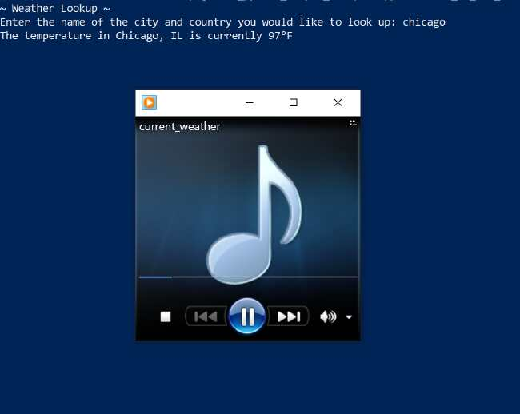

# Python-Projects

## Project 1: Tell me the Weather (Works!)
  This project reads out loud the temperature of the user's desired city. 
  This project utilizes beautifulSoup4, Google Search, 
  and Google's text-to-speech (gtts).  The Windows Media Player will
  launch to read out the temperature and  
  it will close automatically.

#### Requirements: 
  OS: Windows
#### To Run:
  Use Windows PowerShell
  
	$ pip install .
    $ python .\weatherApp\tell_me_the_weather.py
#### To uninstall:
	$ pip uninstall weatherApp
	$ pip uninstall beautifulsoup4
	$ pip uninstall gtts
	

#### Todo:
  &#9744; Change mp3 front cover art to current temp map  
  &#9744; Find users geolocation  
  &#9744; GUI  
  &#9745;
  

