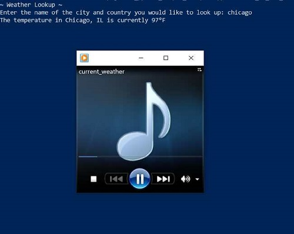

# Python-Projects

## Project 1: Tell me the Weather (Works!)
  This project reads out loud the temperature of the user's desired city. 
  The user's temperature will be displayed in the command line,  
  launch the Windows Media Player to read out the temperature, and it  
  will close automatically.  
  This project utilizes beautifulSoup4, Google Search, and Google's   
  text-to-speech (gtts). Module installation is automated  
  to make the project easier to run. 

#### Requirements: 
  * OS: Windows  
  * pip version 21.2.4 or higher  
  * python 3.9 or higher  
#### To Run:
  Use Windows PowerShell
 
    $ git clone git@github.com:Jennifer184/Python-Projects.git
    $ // cd into the weatherApp directory
    $ pip install .
    $ python weatherApp

#### To uninstall:
	$ pip uninstall weatherApp
	$ pip uninstall beautifulsoup4
	$ pip uninstall gtts
	

#### Todo:
  &#9745; Automate module installation  
  &#9744; Change mp3 front cover art to current temp map  
  &#9744; Find users geolocation  
  &#9744; GUI  
  
  

